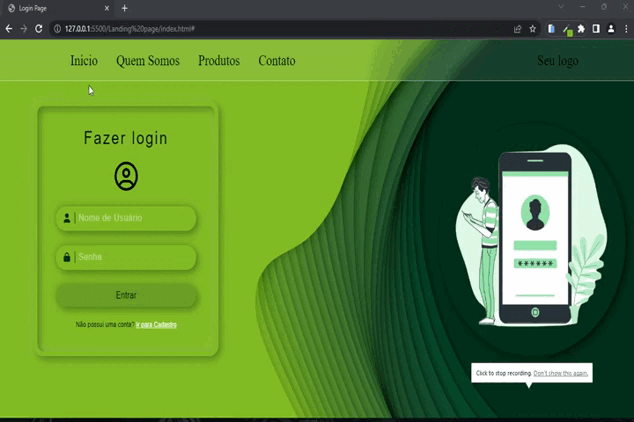

<h1 align="center"><a href="https://gustavo-freita.github.io/Login-Page/">Login Page</a></h1>

## Descrição do Projeto:

Esse primeiro projeto foi criado com o proposito de testar meus estudos usando <a href="https://www.w3schools.com/html/">HTML</a>, <a href="https://www.w3schools.com/Css/">CSS</a> e <a href="https://developer.mozilla.org/en-US/docs/web/javascript/guide/introduction">JavaScript</a>. Assim criando um projeto responsivo e interativo.

## Project Description:

This first project was created with the purpose of testing my studies using <a href="https://www.w3schools.com/html/">HTML</a>, <a href="https://www.w3schools.com/Css/">CSS</a> and <a href="https://developer.mozilla.org/en-US/docs/web/javascript/guide/introduction">JavaScript</a>. Thus creating a responsive and interactive project.

<h2 align="center">

</h2>

<h3 align="center">
  
</h3>

### 🛠 Tecnologias / Technologies

As seguintes ferramentas foram usadas na construção do projeto / The following tools were used in building the project:

- [HTML](https://www.w3schools.com/html/)
- [CSS](https://www.w3schools.com/Css/)
- [JavaScript](https://developer.mozilla.org/en-US/docs/web/javascript/guide/introduction)

<h2>:hammer: Créditos</h2>
Web Page feito por / Web Page made by:

<a href="https://github.com/gustavo-freita">Gustavo Freitas</a> <a href="https://github.com/gustavo-freita">
